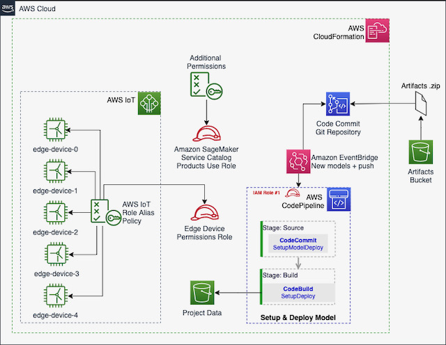
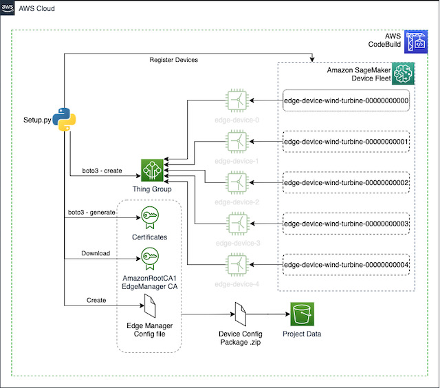

# ML@Edge with SageMaker Edge Manager

[Amazon SageMaker Edge Manager](https://aws.amazon.com/sagemaker/edge-manager/) allows you to optimize, secure, monitor, and maintain ML models on fleets of smart cameras, robots, personal computers, industrial equipments, mobile devices and more. Using [Amazon SageMaker Edge Manager](https://aws.amazon.com/sagemaker/edge-manager/), you can manage the lifecycle of each ML model on each device in your device fleets for up to thousands or millions of devices. The service provides a software **agent that runs on edge devices** and a management interface in the AWS console. First, you **optimize your trained ML model** with SageMaker Neo. For Edge Manager supported devices, Neo automatically generates the runtime as a compilation output, so you don’t need to build the runtime from source on your devices. The Edge Manager agent also **collects prediction data and sends a sample of the data to the cloud for monitoring**, labeling, and retraining so you can keep models accurate over time. You can program how you want to collect the data, and view the data in the SageMaker Edge Manager dashboard which reports on the operation of deployed models.

----
In **this workshop** you will create an end-to-end solution that shows how to detect anomalies in the components of wind turbines. We'll use Amazon SageMaker to prepare a Machine Learning (ML) model and Amazon SageMaker Edge Manager to deploy and run this model to an edge device (small computer).

This workshop has following labs:    
  - [00-Warmup](lab/00-Warmup): This shows a quick overview of the end to end workshop. This is optional if you running all the labs in the workshop.    
  - [01-Data-Visualization](lab/01-Data-Visualization): This lab performs the required pre-processing on the raw turbine data in order to train an anomaly detection model.    
  - [02-Training](lab/02-Training): This lab trains an auto encoder anomaly detector ML model using a SageMaker Pipeline.
  - [03-Package-Deploy](lab/03-Package-Deploy): This lab shows how to compile, package and deploy your model and the inference application(detector). It shows two ways of deploying the model and the inference application. The workshop moderator and the audience need to choose one of the option:       
      - [Using IoT Jobs](lab/03-Package-Deploy/iot-jobs)    
      - [Using Greengrass V2](lab/03-Package-Deploy/greengrass-v2)    
  - [04-Run-Fleet](lab/04-Run-Fleet): This lab shows how to run the simulator creating and running 5 virtual wind turbines. It shows two ways of running the simulator and turbines.Here the selection should be the same as made in the previous lab. Either using:       
      - [Using IoT Jobs](lab/04-Run-Fleet/iot-jobs) OR        
      - [Using Greengrass V2](lab/04-Run-Fleet/greengrass-v2)    

A real Wind Energy Farm can have hundreds or thousands of turbines. Each turbine costs millions of dollars. The maintenance cost is also high and requires very specialized skills. So, what if you could connect a small computer (edge device) to the sensors of these turbines and run on it some Machine Learning (ML) models that can predict anomalies/failures in real-time? A local application could keep monitoring the ML predictions and run contingency procedures as soon as an anomaly is detected, for instance: activate a break or disconnect the generator from the grid. This solution can also send messages to the closest operator and report the device performance to the cloud, for posterior analysis.

We'll use simple simulator (programed in Python) to stream some raw data, collected by the sensors installed in a 3D printed mini wind turbine. Bellow, you can see the macro architecture of the solution.

    
    </img>    

So, the Data Scientist builds the model and prepares a deployment package with SageMaker. Then, through an AWS IoT Job, the edge device is notified about the new model. The application running on the simulated edge device downloads the model package from S3 and the SageMaker Edge Agent loads the new model. The simulator keeps running the turbines and the edge devices as Python Threads.

Here you can see more details of the iterface/dashboard of the simulator. Click on the image to see a video:

    <a href="https://aws-ml-blog.s3.amazonaws.com/artifacts/monitor-manage-anomaly-detection-model-wind-turbine-fleet-sagemaker-neo/wind_farm_simulator.mp4">
        </img>
    </a>

Then, using SageMaker, we will transform this data, prepare, clean and format for training an anomaly detection model. This model is then deployed to an edge device that reads the sensors data and predicts potential anomalies based on the turbine's: vibration, produced energy, rotor speed and wind speed.

## Setup

The workshop was configured as a [SageMaker Studio Project](https://docs.aws.amazon.com/sagemaker/latest/dg/sagemaker-projects.html). So you need to have an AWS account and then execute the following steps:
 1. Configure your own [SageMaker Studio Domain](https://docs.aws.amazon.com/sagemaker/latest/dg/gs-studio-onboard.html) if you don't have one;
 2. Get the name of the IAM role you created for SageMaker Studio;
 3. With your SageMaker Studio Ready, deploy a new CloudFormation stack by clicking on the **Launch Stack** button below: 
 
   
 
It will ask you the **Name, not the ARN** of the Role Studio is using - Curious about how to create your own SageMaker Studio Project Template? Take a look on [this link](https://docs.aws.amazon.com/sagemaker/latest/dg/sagemaker-projects-templates-custom.html);  
    **Make sure you marked the IAM Acknowledge checkbox before creating your Stack** 
 5. The previous step will create a new SageMaker Project template. Now open SageMaker Studio, go to "Components and registries" (left menu: the icon seems like a rotated triangle)
     1. Click on the button **Create Project**;
     2. Click on the tab **Organizational Templates**;
     3. Select the template **SageMaker Edge Manager WindTurbine Workshop**;
     4. If you're not seeing this template and the previous steps were executed correctly, you can force Studio to refresh the environment. In Studio, save all the pending work, then click on File -> Shutdown;
     5. Click on the button **Select project template**;
     6. Give a name for your project: i.e. wind-turbine-farm;
     7. Click on the button **Create project** and wait a couple of minutes. You need to see the status **Created** at the right side of the project name;
5. Double-click on the project name;
6. Click on the tab **Repositories**;
7. You'll see one repository with the name starting with **sagemaker-wind-turbine-farm-**. Click on the link of the **Local path** and clone the repo;
8. Studio will open automatically the folders of the cloned project and you're ready to start the exercises;

### What was created by the project?
The following diagram shows which resources were deployed via CloudFormation by SageMaker projects when you create a new project based on the imported template:

    </img>

After a new project is created, CodePipeline will be triggered automatically to complete the setup of the environment, through the CodeBuild project. New resources will be created and configured by this process. [Click on the this link to open CodePipeline console and check the progress of this step](https://console.aws.amazon.com/codesuite/codepipeline/pipelines). A **.zip** file with the certificates and the configuration file for each Edge Manager device will be prepared and copied to the S3 bucket of the project, as you can see in the diagram bellow:

    </img>

## Running the exercices

Alright, now you are ready to start this workshop. [Click on this link to get started](lab/README.md).
