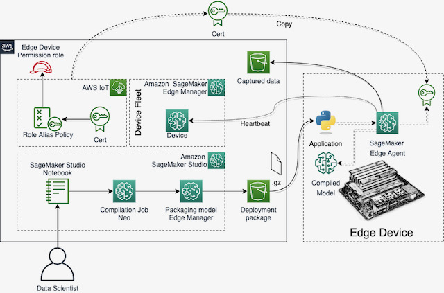

# Module 1 - Running the exercises

This module is divided in four exercises: Warm up, Data Visualization, Model Building and Fleet Simulation. To run the exercises:  
  1. Open SageMaker Studio;
  2. Double-click the project you've created with **SageMaker Edge Manager WindTurbine Workshop** template;
  3. Click on the tab **Repositories**;
  4. Click on the **Local path** link of your repo (clone it if needed);
  5. Double-click on the directory **notebooks** and you will see the following exercices:

## 0/4 - Warm up
<a href="00 - Warmup.ipynb">Notebook</a>: In this notebook you will learn how to prepare a minimalist environment to run SageMaker Edge Agent and invoke its API using Python3; (Select SageMaker Studio Kernel: Data Science)

    </a>

## 1/4 - Data Visualisation
<a href="01 - Data Visualization.ipynb">Notebook</a>: In this notebook you will take a look on the raw data from the sensors, the selected features for training the model and how to prepare the dataset;

## 2/4 - Model Building

<a href="02 - Training with Pytorch.ipynb">Notebook</a>: How to create a ML Pipeline using SageMaker Model Building to: prepare the data, train the model & run batch prediction. Besides, you will see how to compile your trainied model to your edge device using SageMaker NEO and how to create a deployment package using SageMaker Edge Manager. The following diagram, shows the ML Pipeline and the other tasks you'll execute in this exercise.

    </a>

## 3/4 - Fleet Simulation
<a href="03 - Run Fleet.ipynb">Notebook</a>: Here you'll run the simulator of the wind turbine farm and launch 5 SageMaker Edge Agents (one per turbine). A Python application then reads the sensors data, prepares the data and then invokes the anomaly detection model by calling SageMaker Edge Manager's API. You'll be able to visualize all this process in the Simulator's UI. The following diagram shows the application architecture. The application is divided into two parts: Device Application and Simulator.

    </a>

This is an **standalone** setup for SageMaker Edge Manager. It means that no other service like will be used to build the edge device solution. In this case, the application that runs on the edge device needs to do some key tasks like Deploying/Updating the model. 

In the image bellow you can see the Python application (OTAModelUpdater) that communicates with an MQTT Topic is reponsible for receiving the **new model message** from the IoT Job and deploy the model to the edge device. The model package is downloaded from an S3 bucket and verified by the SageMaker Edge Agent.

    </a>

### Device application
This is a Python application that could be deployed into a real device. It is responsible for reading the sensors (from the simulator in this case), prepare the data and invoke the model through SageMaker Edge Agent client (protobufer stubs, generated from the **.proto** file provided by the agent) and updates the Simulator Dashboard. It has the infinite loop that process the anomalies for all the Wind Turbines.

### Simulator
This is a multithreaded application that launches one Thread per each Turbine and Each edge device to simulate a real environment, where you would have one Edge device connected to each Wind Turbine. It also has a dashboard with animation and some buttons, that you can see [here](../README.md).

The buttons serve to inject noise into the read data and simulates anomalies that are detected by the ML Model and plotted as violations in the Dashboard.

### Cleaning
In notebook #3, there are instructions of how to delete the project and all the resources created for it. Just run the cell and wait for the cleanup.
